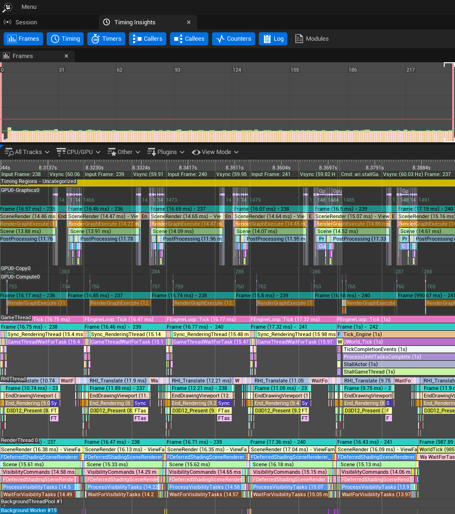
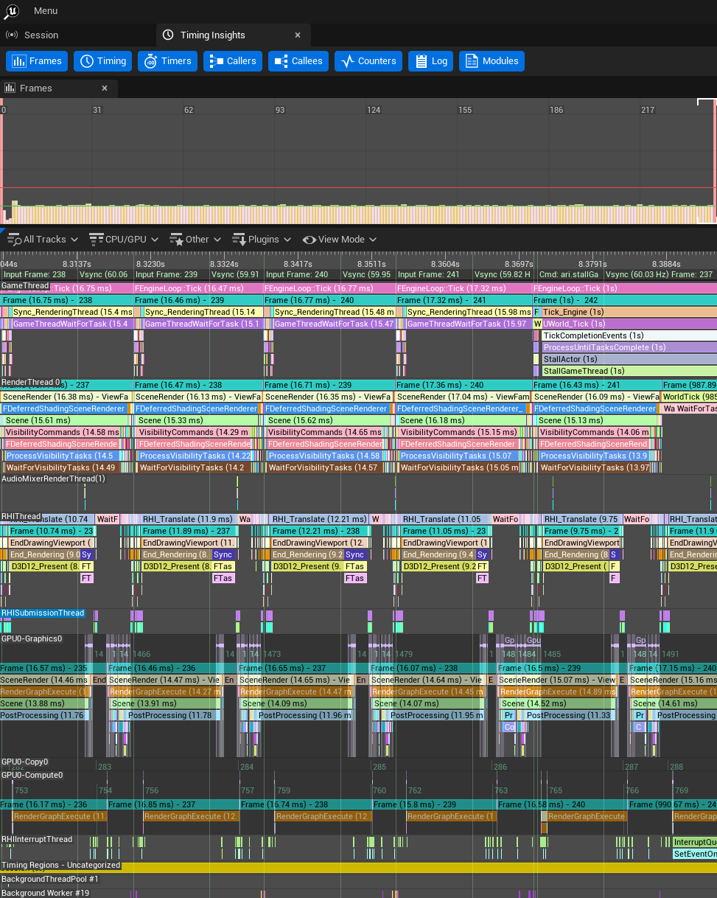

# Insights Track Order Plugin

A plugin for Unreal Insights that allows you to customize the order of tracks (lanes) in the Timing View based on a configuration file.

## Overview

When profiling with Unreal Insights, the Timing View displays many tracks (threads, GPU activity, etc.) in a default order. This plugin lets you prioritize important tracks so they appear at the top of the view, making it easier to focus on the performance data that matters most to your workflow.

Before sorting:


After sorting:


## Features

- **Configurable Track Ordering**: Specify which tracks should appear first (top-most) in the Timing View
- **Substring Matching**: Flexible pattern matching - "GPU" matches "GPU", "GPU2", "GPU Queue 0", etc.
- **Dynamic Track Detection**: Automatically handles tracks that are added after the profiling session starts (e.g., worker threads spawned during execution)
- **Preserves Default Order**: Non-prioritized tracks appear below priority tracks in their original order

## Configuration

The plugin reads its configuration from:
```
Engine/Plugins/InsightsTrackOrder/Config/InsightsTrackOrder.ini
```

### Configuration Format

Add tracks to the `[InsightsTrackOrder]` section using the `+PriorityTracks` array syntax:

```ini
[InsightsTrackOrder]
+PriorityTracks=GameThread
+PriorityTracks=RenderThread
+PriorityTracks=RHIThread
+PriorityTracks=RHISubmissionThread
+PriorityTracks=GPU
```

Tracks will appear in the Timing View in the order listed, with prioritized tracks at the top.

### Pattern Matching

Track names are matched using substring comparison:
- `"GameThread"` matches "GameThread"
- `"GPU"` matches "GPU", "GPU2", "GPU Queue 0", "GPU Queue 1", etc.
- `"Worker"` would match "WorkerThread0", "WorkerThread1", etc.

If a track matches multiple patterns, the earliest pattern in the list takes precedence.

## How It Works

The plugin registers as a Timing View Extender and:
1. Loads the priority track list from the configuration file on startup
2. Periodically scans all scrollable tracks in the Timing View (~once per second)
3. Matches track names against the configured patterns
4. Reorders tracks so priority tracks appear first, followed by all other tracks
5. Maintains the relative order within each group (prioritized and non-prioritized)

## Use Cases

- **Rendering Performance**: Put GPU, RenderThread, and RHIThread at the top in the order data flows through the engine's graphics pipeline
- **Gameplay Focus**: Prioritize GameThread and related gameplay threads
- **Streaming Analysis**: Bring streaming-related threads to the top
- **Custom Workflows**: Order tracks based on your specific profiling needs

## Installation

Put the plugin in your `Engine/Plugins` directory and rebuild the `UnrealInsights` program. The plugin will automatically load when you launch Unreal Insights and apply the track ordering from the configuration file.

To customize the track order, edit `Engine/Plugins/InsightsTrackOrder/Config/InsightsTrackOrder.ini` and restart Unreal Insights.
